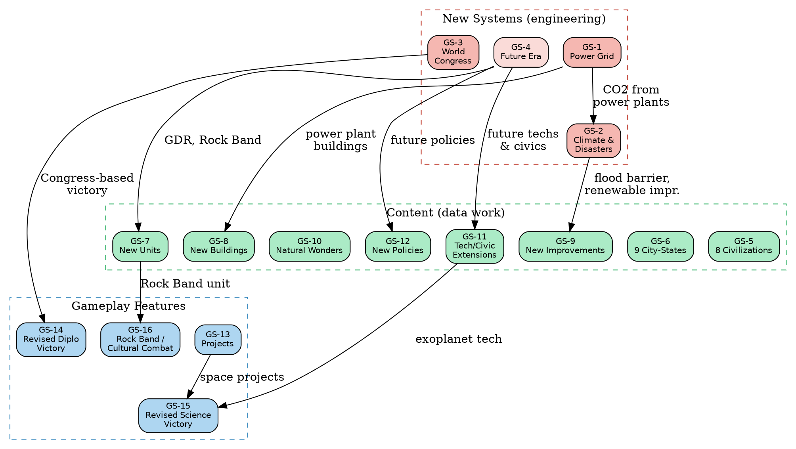

# Gathering Storm Parity Roadmap

> **Reference XML**: `original-xml/DLC/Expansion2/Data/Expansion2_*.xml`
>
> This roadmap covers Gathering Storm (GS) content. Rise & Fall (R&F) content
> is bundled in the same folder as `Expansion1_*.xml` files; where R&F systems
> are prerequisites for GS features, they are noted.

## What We Already Have (from base game + GS spillover)

Some GS content was already implemented because it made architectural sense:

| Item | Status | Notes |
|---|---|---|
| Dam, Canal, Aqueduct districts | Done | Already in BuiltinDistrict |
| WaterPark district | Done | GS content, already implemented |
| Reef, VolcanicSoil features | Done | Tagged as GS in feature.rs |
| Loyalty system | Done | Originally R&F, fully implemented |
| Governors (7 + Ibrahim) | Done | Originally R&F, fully implemented |
| Era Ages (Golden/Dark/Heroic) | Done | Originally R&F, fully implemented |
| Alliances | Partial | DiplomaticRelation exists; formal alliance types not yet |

## New Systems (Major Engineering Work)

These are entirely new gameplay systems that don't exist in the engine yet.

### GS-1: Power & Energy Grid

The biggest new system. Buildings consume and generate power. Cities without
sufficient power suffer yield penalties.

**New concepts:**
- `Power` yield type (or tracked separately like amenities)
- Power-generating buildings: Coal Power Plant, Oil Power Plant, Nuclear Power
  Plant, Hydroelectric Dam, Solar Farm, Wind Farm, Geothermal Plant
- Power-consuming buildings: most Industrial+ era buildings
- City power balance: excess = bonus yields, deficit = penalty
- CO2 emissions per power source (feeds into climate)

**Files to create:**
- `libciv/src/civ/power.rs` — power tracking per city
- Modifications to `compute_yields()` for power bonuses/penalties
- New buildings in `building_defs.rs`

**Effort**: XL (new system + building chain + yield integration)

### GS-2: Climate Change & Environmental Disasters

Progressive global warming system with random natural disasters.

**Climate change:**
- Global CO2 accumulation from fossil fuel power plants
- 7 levels of sea level rise
- Coastal lowland tiles submerged progressively
- Flood Barrier building to protect cities

**Environmental disasters (RandomEvents):**
- Volcanic eruptions (gentle → megacolossal)
- Floods (moderate → 1000-year)
- Storms: blizzards, dust storms, tornadoes, hurricanes
- Droughts (major → extreme)
- Nuclear accidents
- Each event damages tiles/units but may add fertility

**Files to create:**
- `libciv/src/world/climate.rs` — CO2 tracking, sea level, coastal lowlands
- `libciv/src/world/disaster.rs` — random event system, disaster types, damage
- New phase in `advance_turn` for disaster resolution
- Tile modifications (submerged, volcanic soil added)

**Effort**: XXL (multiple interacting systems)

### GS-3: World Congress

Diplomatic system where civs vote on global resolutions.

**Components:**
- 23 resolutions (trade treaties, arms control, heritage org, etc.)
- Diplomatic favor accumulation (replaces our current simple system)
- Voting mechanics (favor spent as votes)
- Special sessions (emergencies, competitions)
- Nobel Prizes, World Games, Climate Accords
- Revised Diplomatic Victory (win through Congress, not favor threshold)

**Files to create:**
- `libciv/src/civ/congress.rs` — World Congress state, resolutions, voting
- `RulesEngine::propose_resolution()`, `vote_on_resolution()`
- New advance_turn phase for Congress sessions

**Effort**: XXL (complex voting + resolution effects)

### GS-4: Future Era

New endgame era with sci-fi content.

**New techs** (~11): Advanced AI, Advanced Power Cells, Cybernetics, Smart
Materials, Predictive Systems, Offworld Mission, Seasteads, Future Tech

**New civics** (~11): Environmentalism, Corporate Libertarianism, Digital
Democracy, Synthetic Technocracy, Information Warfare, Exodus Imperative,
Cultural Hegemony, Near Future Governance, Future Civic

**New governments** (3): Corporate Libertarianism, Digital Democracy,
Synthetic Technocracy

**New units**: Giant Death Robot, Rock Band (cultural combat unit)

**New improvements**: Seastead, Mountain Tunnel, Ski Resort

**Effort**: L (content additions to existing systems)

## Content Additions (Data Work)

### GS-5: New Civilizations (8 major)

| Civilization | Leader | Unique Unit | Unique Infrastructure |
|---|---|---|---|
| Canada | Laurier | Mountie | Hockey Rink (improvement) |
| Hungary | Matthias Corvinus | Huszar | Thermal Bath (building) |
| Inca | Pachacuti | Warakaq | Terrace Farm (improvement) |
| Mali | Mansa Musa | Mandekalu Cavalry | Suguba (district) |
| Maori | Kupe | Toa | Pa (improvement) |
| Ottoman | Suleiman | Barbary Corsair | Grand Bazaar (building) |
| Phoenicia | Dido | Bireme | Cothon (district) |
| Sweden | Kristina | Carolean | Open-Air Museum (building) |

**Effort**: L (follows existing civ_registry pattern)

### GS-6: New City-States (9)

Akkad, Bologna, Cahokia, Cardiff, Fez, Mexico City, Nazca, Ngazargamu, Rapa Nui

**Effort**: S (follows existing city_state_defs pattern)

### GS-7: New Units (~5 generic + civ-unique)

| Unit | Era | Type | Notes |
|---|---|---|---|
| Skirmisher | Medieval | Ranged | New ranged unit tier |
| Courser | Medieval | Light Cavalry | New cavalry tier |
| Cuirassier | Renaissance | Heavy Cavalry | New cavalry tier |
| Rock Band | Modern | Cultural | Cultural combat (tourism) |
| Giant Death Robot | Atomic | Heavy Cavalry | Superweapon |

Plus ~8 civ-unique units for the 8 new civs.

**Effort**: M (unit_defs additions + Rock Band needs cultural combat system)

### GS-8: New Buildings (~20)

Power plants (Coal, Oil, Nuclear, Hydroelectric, Solar, Wind, Geothermal),
Flood Barrier, Food Market, Shopping Mall, Aquatics Center, plus civ-unique
buildings (Thermal Bath, Grand Bazaar, Open-Air Museum).

**Effort**: M (building_defs additions, but power plant buildings need GS-1)

### GS-9: New Improvements (~10)

Solar Farm, Wind Farm, Offshore Wind Farm, Geothermal Plant, Seastead,
Mountain Tunnel, Ski Resort, plus civ-unique (Terrace Farm, Pa, Hockey Rink,
Moai, Nazca Line).

**Effort**: M (improvement enum + requirements)

### GS-10: New Natural Wonders (~7)

Chocolate Hills, Devil's Tower, Gobustan, Ik-Kil, Pamukkale, White Desert,
Vesuvius (volcanic wonder).

**Effort**: S (follows existing wonder pattern)

### GS-11: Tech & Civic Tree Extensions

~11 new techs + ~11 new civics for the Future Era, plus modifications to
existing era tech/civic costs and prerequisites.

**Effort**: M (tree node additions)

### GS-12: New Policies (~16)

Future-era policies for the 3 new governments, plus military/diplomatic
additions (Equestrian Orders, Drill Manuals, Cyber Warfare, etc.).

**Effort**: S (policy_defs additions)

### GS-13: Projects (~14)

Space race additions (Exoplanet Expedition), climate projects (Carbon
Recapture, Decommission Power Plant), World Congress competitions (Train
Athletes, Train Astronauts, Orbital Laser).

**Files to create:**
- `libciv/src/civ/project.rs` — city project system
- Production queue support for `ProductionItem::Project`

**Effort**: M (new production type + project definitions)

### GS-14: Revised Diplomatic Victory

Replace current favor-threshold victory with World Congress-based system.
Victory points earned through Congress resolutions and competitions.

**Blocked by**: GS-3 (World Congress)

**Effort**: S (once Congress exists)

### GS-15: Revised Science Victory

Add 4th milestone: Exoplanet Expedition (requires Future Era tech).

**Effort**: S (add milestone to existing system)

### GS-16: Rock Band / Cultural Combat

New unit type that "attacks" cities with tourism instead of military damage.
Gains fans (XP equivalent), can earn promotions, risks disbanding.

**Effort**: M (new combat resolution path)

## Dependency Graph

## Implementation Order

### Wave 1: Independent content (no new systems needed)

All can run in parallel, no dependencies on new GS systems:

| Item | Scope | Notes |
|---|---|---|
| GS-5 Civilizations | 8 civs | Existing civ_registry pattern |
| GS-6 City-States | 9 city-states | Existing city_state_defs pattern |
| GS-10 Natural Wonders | 7 wonders | Existing wonder pattern |
| GS-11 Future Era techs/civics | ~22 nodes | Existing tree pattern |
| GS-12 Policies | ~16 policies | Existing policy_defs pattern |

### Wave 2: Power system + buildings

| Item | Scope | Notes |
|---|---|---|
| GS-1 Power Grid | New system | Foundation for climate and buildings |
| GS-8 Buildings | ~20 buildings | Power plants need GS-1 |
| GS-9 Improvements | ~10 improvements | Renewable energy needs GS-1 |

### Wave 3: Climate + Congress

| Item | Scope | Notes |
|---|---|---|
| GS-2 Climate & Disasters | New system | Needs GS-1 for CO2 |
| GS-3 World Congress | New system | Independent of GS-1/GS-2 |
| GS-13 Projects | New production type | Needed for revised victories |

### Wave 4: Victory revisions + new gameplay

| Item | Scope | Notes |
|---|---|---|
| GS-4 Future Era content | Units + governments | Content for new era |
| GS-7 New Units | ~13 total | Includes Rock Band |
| GS-14 Revised Diplomatic Victory | Rework | Needs GS-3 |
| GS-15 Revised Science Victory | Add milestone | Needs GS-11 + GS-13 |
| GS-16 Cultural Combat | New combat path | Rock Band mechanic |

## Effort Estimate

| Category | Items | Effort |
|---|---|---|
| New systems | 3 (Power, Climate, Congress) | XXL |
| Content additions | 8 items | M–L each |
| Gameplay features | 4 items | S–M each |
| **Total** | **16 items** | **~3–6 months** |

## What's NOT Included

- **Rise & Fall standalone features** (already implemented: loyalty, governors,
  era ages, emergencies). Alliance types are partially done.
- **Scenario content** (Vikings, Black Death, Pirates, etc.)
- **DLC-specific civs** (Babylon, Ethiopia, Byzantium, etc. — separate DLC packs)
- **Barbarian Clans mode** (already implemented as base-game extension)
