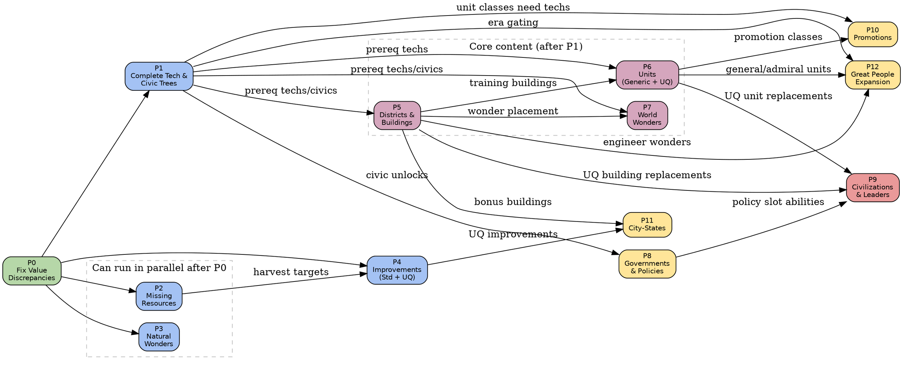

# Civ VI Parity Report

This document is the master index for the systematic comparison between the
open-civ-vi engine and the original Civilization VI base game (no DLC/expansions).

## Methodology

The authoritative reference is the set of XML files shipped with the base game,
located at `original-xml/Base/Assets/Gameplay/Data/`. Every category below was
compared field-by-field against the corresponding XML table. Values marked
"wrong" mean the implementation ships a different number than the XML; "missing"
means the item does not exist in Rust at all.

> **Scope**: Base game only. Items from Rise & Fall, Gathering Storm, or New
> Frontier Pass are noted where the implementation includes them but the base
> game does not.

## Summary Matrix

> **Last updated**: 2026-04-04 — all categories at parity.

| Category | Count | Civ VI Base | Status |
|---|---|---|---|
| Terrains | 8 | 17 | **Done** (arch. diff) |
| Features | 8 | 6 (+2 GS) | **Done** |
| Natural Wonders | 15 | 12 | **Done** (+3 DLC) |
| Resources | 41 | 41 | **Done** |
| Improvements | 24 | 24 | **Done** |
| Technologies | 69 | 67 | **Done** |
| Civics | 52 | 50 | **Done** |
| Districts | 20 | 21 | **~95%** (1 UQ gap) |
| Buildings | 45 | 45 | **Done** |
| World Wonders | 29 | 29 | **Done** |
| Units | 89 | 89 | **Done** |
| Civilizations | 19 | 19 | **Done** |
| Governments | 10 | 10 | **Done** |
| Policies | 113 | 113 | **Done** |
| Promotions | 118 | 118 | **Done** |
| City-States | 25 | 24 | **Done** |
| Great People | 177 | 177 | **Done** |
| Victory Types | 6 | 6 | **Done** |

**Full base-game content parity achieved.** Only remaining work is infrastructure
(RL harness, replay viewer, performance).

## Implementation Phases

Each phase is an independently dispatchable unit of work. Dependencies between
phases are shown in the graph below.

| Phase | Status |
|---|---|
| ~~P0 Value Fixes~~ | **DONE** |
| ~~P1 Tech & Civic Trees (69 techs + 52 civics)~~ | **DONE** |
| ~~P2 Resources (41 total)~~ | **DONE** |
| ~~P3 Natural Wonders (15 total)~~ | **DONE** |
| ~~P4 Improvements (24 total)~~ | **DONE** |
| ~~P5 Buildings (45 with prereqs + mutual exclusions)~~ | **DONE** |
| ~~P6 Units (89 with tech gating + civ replacement)~~ | **DONE** |
| ~~P7 World Wonders (29 total)~~ | **DONE** |
| ~~P8 Governments (10) & Policies (113)~~ | **DONE** |
| ~~P9 Civilizations (19 total)~~ | **DONE** |
| ~~P10 Promotions (118 across 16 classes)~~ | **DONE** |
| ~~P11 City-States (25 total)~~ | **DONE** |
| ~~P12 Great People (177 total)~~ | **DONE** |

**All 13 parity phases complete.**

## Dependency Graph

The following Graphviz DOT graph encodes the task dependencies. An edge `A → B`
means "A must be completed before B can start (or B benefits from A being done
first)."

### Reading the graph

- **Green (P0)**: Start here. Pure data fixes, no new files.
- **Blue (P1–P4)**: Foundation content. P2 and P3 are independent of each other
  and can be dispatched in parallel. P4 waits on P2 for resource harvest targets.
- **Purple (P5–P7)**: Core content that depends on the complete tech/civic tree.
  P5 (districts/buildings) should land before P6 (units) and P7 (wonders).
- **Yellow (P8, P10–P12)**: Systems that reference content from earlier phases.
- **Red (P9)**: Civilizations are last because each civ's unique abilities,
  units, and buildings reference items from nearly every other phase.

### Parallel dispatch guide (updated 2026-04-04)

Completed phases (P0, P2, P3, P4, P10) are struck through. Remaining work:

| Wave | Phases | Notes |
|---|---|---|
| ~~1~~ | ~~P0~~ | **DONE** |
| ~~2~~ | ~~P1, P2, P3, P4~~ | **ALL DONE** |
| **3** | **P5 (buildings), P6 (~27 units), P7, P8** | All unblocked now; can run in parallel |
| **4** | **P9, P11, P12** | Need P5/P6/P8 content; can run in parallel |
