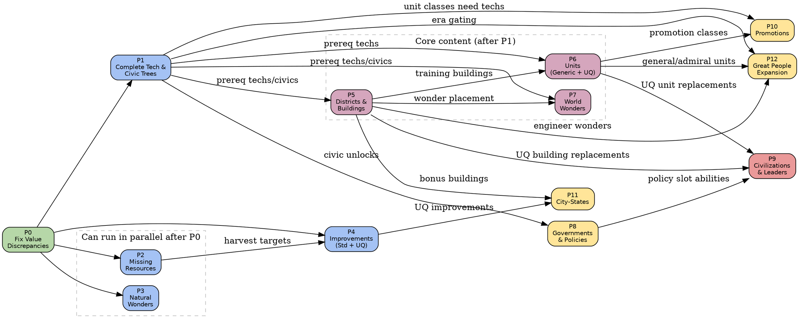

# Civ VI Parity Report

This document is the master index for the systematic comparison between the
open-civ-vi engine and the original Civilization VI base game (no DLC/expansions).

## Methodology

The authoritative reference is the set of XML files shipped with the base game,
located at `original-xml/Base/Assets/Gameplay/Data/`. Every category below was
compared field-by-field against the corresponding XML table. Values marked
"wrong" mean the implementation ships a different number than the XML; "missing"
means the item does not exist in Rust at all.

> **Scope**: Base game only. Items from Rise & Fall, Gathering Storm, or New
> Frontier Pass are noted where the implementation includes them but the base
> game does not.

## Summary Matrix

| Category | Implemented | Civ VI Base | Missing | Wrong Values | Detail Doc |
|---|---|---|---|---|---|
| Terrains | 8 base types | 15 land + 2 water | ~0 (arch. difference) | 0 | — |
| Features | 8 | 6 | 0 (+2 non-base) | 0 | — |
| Natural Wonders | 5 | 12 | 9 | 2 | [content](parity-content.md#natural-wonders) |
| Bonus Resources | 8 | 10 | 2 | 0 | [content](parity-content.md#resources) |
| Luxury Resources | 8 | 24 | 16 | 4 | [values](parity-values.md#resource-yields) |
| Strategic Resources | 7 | 7 | 0 | 3 | [values](parity-values.md#resource-yields) |
| Improvements (std) | 12 | 15 | 3 | 1 | [content](parity-content.md#improvements) |
| Unique Improvements | 2 | 9 | 7 | 0 | [content](parity-content.md#unique-improvements) |
| Technologies | 12 (Ancient) | 67 (8 eras) | 56 | 2 | [trees](parity-trees.md#technologies) |
| Civics | 5 (Ancient) | 50 (8 eras) | 46 | 2 | [trees](parity-trees.md#civics) |
| Districts | 12 | 13 std + 8 UQ | 4 std, 6 UQ | 4 prereqs | [content](parity-content.md#districts) |
| Buildings | ~6 | 66 | ~60 | — | [content](parity-content.md#buildings) |
| World Wonders | 0 | 29 | 29 | — | [content](parity-content.md#world-wonders) |
| Units (generic) | 5 | 77 | 72 | 1 | [content](parity-content.md#units) |
| Units (unique) | 8 | 21 | 13 | 2 | [content](parity-content.md#unique-units) |
| Civilizations | 8 | 19 | 11 | 1 (Babylon=DLC) | [systems](parity-systems.md#civilizations) |
| Governments | 2 | 10 | 8 | — | [systems](parity-systems.md#governments) |
| Policies | 4 | 113 | 109 | — | [systems](parity-systems.md#policies) |
| Promotions | 0 | 122 | 122 | — | [systems](parity-systems.md#promotions) |
| City-States | 0 | 24 | 24 | — | [systems](parity-systems.md#city-states) |
| Great People | ~72 | ~177 | ~105 | — | [systems](parity-systems.md#great-people) |

## Implementation Phases

Each phase is an independently dispatchable unit of work. Dependencies between
phases are shown in the graph below.

| Phase | Title | Scope | Est. Effort |
|---|---|---|---|
| **P0** | [Fix Value Discrepancies](parity-values.md) | 15 yield/cost/prereq corrections in existing code | S |
| **P1** | [Complete Tech & Civic Trees](parity-trees.md) | Add 56 techs + 46 civics across 7 eras | L |
| **P2** | [Missing Resources](parity-content.md#resources) | 2 bonus + 16 luxury resources; enum + yields | M |
| **P3** | [Missing Natural Wonders](parity-content.md#natural-wonders) | 9 natural wonders with yields | M |
| **P4** | [Standard Improvements](parity-content.md#improvements) | Oil Well, Offshore Rig, Beach Resort + 7 UQ improvements | M |
| **P5** | [Districts & Buildings](parity-content.md#districts) | 4 missing districts, fix 4 prereqs, ~60 buildings | XL |
| **P6** | [Units](parity-content.md#units) | ~72 generic + 13 unique unit type defs | XL |
| **P7** | [World Wonders](parity-content.md#world-wonders) | 29 wonder definitions | L |
| **P8** | [Governments & Policies](parity-systems.md#governments) | 8 governments + 109 policies | L |
| **P9** | [Civilizations & Leaders](parity-systems.md#civilizations) | 11 missing civs with abilities + UQ units/buildings | XL |
| **P10** | [Promotions](parity-systems.md#promotions) | 122 promotions across 16 classes | L |
| **P11** | [City-States](parity-systems.md#city-states) | 24 city-states with types and bonuses | M |
| **P12** | [Great People Expansion](parity-systems.md#great-people) | ~105 missing individuals across all types | L |

## Dependency Graph

The following Graphviz DOT graph encodes the task dependencies. An edge `A → B`
means "A must be completed before B can start (or B benefits from A being done
first)."

### Reading the graph

- **Green (P0)**: Start here. Pure data fixes, no new files.
- **Blue (P1–P4)**: Foundation content. P2 and P3 are independent of each other
  and can be dispatched in parallel. P4 waits on P2 for resource harvest targets.
- **Purple (P5–P7)**: Core content that depends on the complete tech/civic tree.
  P5 (districts/buildings) should land before P6 (units) and P7 (wonders).
- **Yellow (P8, P10–P12)**: Systems that reference content from earlier phases.
- **Red (P9)**: Civilizations are last because each civ's unique abilities,
  units, and buildings reference items from nearly every other phase.

### Parallel dispatch guide

Agents can be dispatched concurrently for phases that share no edge:

| Wave | Phases | Notes |
|---|---|---|
| 1 | P0 | Must complete first |
| 2 | P1, P2, P3 | All independent; P1 is the critical path |
| 3 | P4 | Needs P2 |
| 4 | P5, P8 | P5 needs P1; P8 needs P1 |
| 5 | P6, P7 | Both need P5 |
| 6 | P10, P11, P12 | Need P6/P5 |
| 7 | P9 | Needs P5, P6, P8 |
